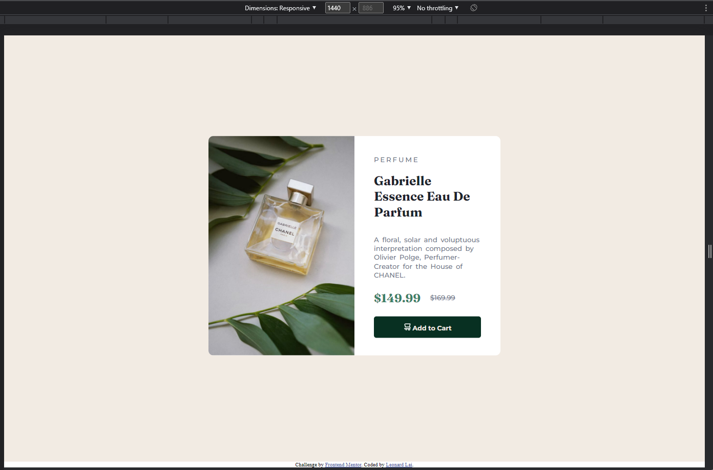
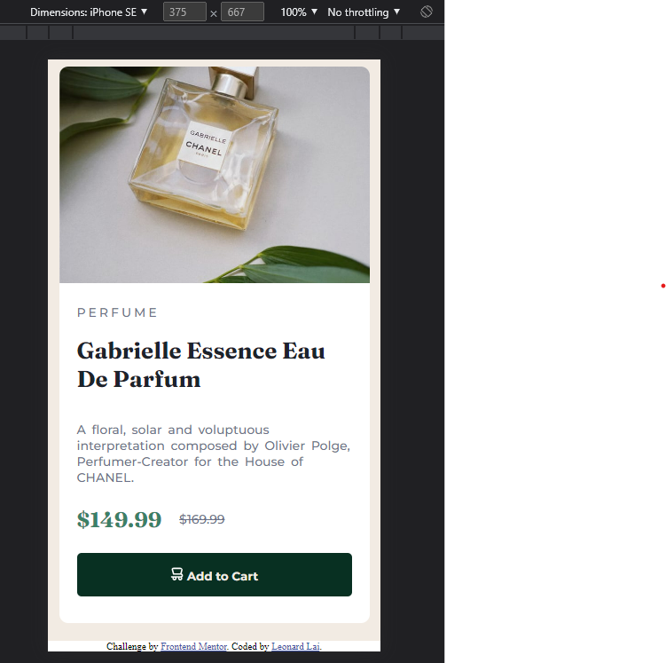

# Frontend Mentor - Product preview card component solution

This is a solution to the [Product preview card component challenge on Frontend Mentor](https://www.frontendmentor.io/challenges/product-preview-card-component-GO7UmttRfa). Frontend Mentor challenges help you improve your coding skills by building realistic projects. 

## Table of contents

- [Overview](#overview)
  - [The challenge](#the-challenge)
  - [Screenshot](#screenshot)
  - [Links](#links)
- [My process](#my-process)
  - [Built with](#built-with)
  - [Useful resources](#useful-resources)
- [Author](#author)

## Overview

This is my attempt on [Product preview card component challenge on Frontend Mentor](https://www.frontendmentor.io/challenges/product-preview-card-component-GO7UmttRfa). 

### The challenge

Users should be able to:

- View the optimal layout depending on their device's screen size
- See hover and focus states for interactive elements

### Screenshot

### Links

- Solution URL: [Add solution URL here](https://your-solution-url.com)
- Live Site URL: [Add live site URL here](https://your-live-site-url.com)

## My process
Analyse the design file and think through what needs to be built in terms of component. 

My approach is builting from "out to in", step as follow:

Desktop:
1. built the html portion for the beige background, then css for the same section
2. built html portion for the product card, then css for the same section
3. built the left & right portion of card in html, then followed by css on styling

Mobile: 
1. Identify the component from desktop version that can be reused, and style the remaining that unable to reuse

### Built with

- Semantic HTML5 markup
- CSS

### Useful resources

- [mdn web docs](https://developer.mozilla.org/en-US/docs/Web/CSS) - This help me with all the html tag and CSS syntax. All the interactive guides are using useful in helping me identify what was required to complete this project
- [w3schools](https://www.w3schools.com/) - Alternative to the above guide

## Author

- [Leonard Lai]
- Frontend Mentor - [@leonardlai](https://www.frontendmentor.io/profile/leonardlai)
